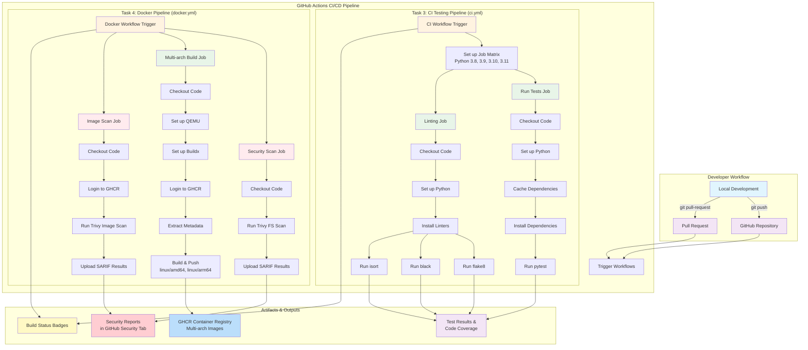

# Python CI/CD Pipeline with Docker 🚀

[](https://github.com/saeedmfat/python-basic-ci/actions/workflows/ci.yml)
[](https://github.com/saeedmfat/python-basic-ci/actions/workflows/docker.yml)
[](https://github.com/saeedmfat/python-basic-ci/pkgs/container/python-basic-ci)
[](https://python.org)
[](https://docker.com)

A modern Python CI/CD pipeline demonstrating GitHub Actions best practices with automated testing, linting, security scanning, and multi-architecture Docker builds.

## 📦 Features

### ✅ Task 3: CI Testing Pipeline
- **🤖 Automated Testing**: Runs pytest on multiple Python versions (3.8, 3.9, 3.10, 3.11)
- **🎯 Code Quality**: Flake8 linting with PEP8 compliance
- **✨ Code Formatting**: Black and isort formatting checks
- **⚡ Smart Caching**: Optimized dependency caching for faster workflows
- **🔍 Pull Request Integration**: Automatic checks on every PR

### 🐳 Task 4: Docker Pipeline
- **📦 Containerization**: Docker image building with best practices
- **🛡️ Security Scanning**: Trivy vulnerability scanning (source code + container images)
- **🏗️ Multi-Architecture**: Builds for both `linux/amd64` and `linux/arm64`
- **📚 GHCR Integration**: Automatic pushes to GitHub Container Registry
- **🔒 Security Integration**: SARIF reports in GitHub Security tab

## 🏗️ Project Structure

```
.
├── app/
│   └── calculator.py          # Sample calculator module
├── tests/
│   └── test_calculator.py     # Pytest test cases
├── .github/
│   └── workflows/
│       ├── ci.yml            # Task 3: CI testing workflow
│       └── docker.yml        # Task 4: Docker build workflow
├── Dockerfile                # Multi-stage Dockerfile
├── requirements-test.txt     # Test dependencies
└── .trivyignore             # Trivy ignore rules
```

## ⚙️ Setup & Usage

### Local Development
```bash
# Clone repository
git clone https://github.com/saeedmfat/python-basic-ci.git
cd python-basic-ci

# Install dependencies
pip install -r requirements-test.txt

# Run tests
pytest -v

# Run linters
flake8 . --max-line-length=127
black --check --line-length 127 .
```

### Using the Docker Image
```bash
# Pull the image
docker pull ghcr.io/saeedmfat/python-basic-ci:latest

# Run tests (default CMD)
docker run ghcr.io/saeedmfat/python-basic-ci:latest

# Run with shell access
docker run -it ghcr.io/saeedmfat/python-basic-ci:latest sh
```

## 📊 Workflows

### 🔄 CI Testing Workflow (`ci.yml`)
**Triggers**: On every push and pull request  
**Jobs**:
1. **Test Matrix**: Runs pytest across Python 3.8, 3.9, 3.10, 3.11
2. **Linting**: Flake8, Black, and isort code quality checks

### 🐳 Docker Build Workflow (`docker.yml`)
**Triggers**: On push to main branch  
**Jobs**:
1. **Security Scan**: Trivy source code vulnerability scanning
2. **Multi-arch Build**: Builds Docker images for amd64/arm64
3. **Image Scan**: Trivy container vulnerability scanning

## 🛡️ Security Features

- **🔍 Trivy Scanning**: Comprehensive vulnerability detection
- **📋 SARIF Reports**: GitHub Security tab integration
- **🚫 .trivyignore**: Managed vulnerability exceptions
- **🔐 GITHUB_TOKEN**: Secure authentication with GHCR

## 🌐 Multi-Architecture Support

The Docker image supports multiple architectures:
- `linux/amd64` - Standard servers and cloud instances
- `linux/arm64` - Apple Silicon, Raspberry Pi, AWS Graviton




```bash
# Deploy to any Docker-supported environment
docker run -d \
  --name python-app \
  ghcr.io/saeedmfat/python-basic-ci:latest
```

## 📝 License

This project is open source and available under the [MIT License](LICENSE).

---

**⭐ Star this repo if you found it useful!**